# `chat_stream.py` 코드 흐름

`create_chat_stream_router()`가 등록하는 `chat_stream()`, 멀티턴 질문 재작성 함수들
(`_rewrite_question` 등), 그리고 이벤트를 SSE 줄로 바꾸는 `_format_event()`의 내부 로직을
정리한 것. 세 문서가 이 기능을 서로 다른 각도로 다룬다 — 헷갈리면 아래 기준으로 찾아가면 된다.

| 문서 | 다루는 것 |
|---|---|
| `docs/hanju/api/multi_turn_chat_design.md` | **왜** 이렇게 설계했는지 (검토·의사결정 기록, 구현 전 작성됨) |
| `docs/hanju/api/multi_turn_chat_api.md` | `session_id` 파라미터의 요청/응답 계약 (FE-BE 통신 契약) |
| 이 문서(`chat_stream.md`) | **서버 안에서 코드가 실제로 어떤 순서로 분기하는지** |

기존 단일 질문 SSE 이벤트 포맷 자체(요청/응답 시퀀스, 이벤트 종류별 JSON 모양)는
`docs/hanju/api/chat_stream_api.md`를 참고.

## `chat_stream()` — `GET /api/v1/chat-stream`

기존 `_run_chat_pipeline`(app/main.py)은 그대로 재사용한다 — 이 파일은 그 앞에서 필요하면
질문을 재작성하고, 그 결과를 SSE 형식으로 "포장"한다. `run_chat_pipeline`을 함수 인자로 받는
이유는 `documents.py`의 `trigger_processing`과 같다: main.py를 직접 import하면 순환 참조가
나서, main.py 쪽에서 만들어 넘겨받는다.

```mermaid
flowchart TD
    A["GET /chat-stream 요청 수신<br/>(query: question, session_id)"] --> B{"session_id가 있나?"}
    B -- "없음 (싱글턴)" --> F0["final_question = question 그대로"]
    B -- "있음" --> P["'이전 대화 확인 중...' progress 이벤트 전송"]
    P --> Q["세션 없으면 생성 (_get_or_create_chat_session)"]
    Q --> R["최근 turn 조회, 토큰 예산 내로 자름 (_load_recent_turns)"]
    R --> RL["등록된 라벨 전체 조회 (_get_available_document_labels)"]
    RL --> S["_rewrite_question() 호출<br/>(내부 분기는 아래 별도 다이어그램)"]
    S --> F0
    F0 --> C["ChatRequest(question=final_question) 생성"]
    C --> D["run_chat_pipeline(request, body) 호출<br/>→ (kind, payload)를 순서대로 만들어내는<br/>비동기 제너레이터"]
    D --> E{"파이프라인에서<br/>다음 이벤트가 나오나?"}
    E -- "예: (kind, payload)" --> G["kind=='result'면 답변 텍스트를<br/>answer_text에 따로 저장"]
    G --> H["_format_event(kind, payload) 호출"]
    H --> I{"SSE 줄로 변환됐나?<br/>(kind='timing'이면 None)"}
    I -- "아니오 (None)" --> E
    I -- "예" --> J["yield event → 클라이언트로 즉시 전송"]
    J --> E
    E -- "아니오 (파이프라인 끝)" --> K{"session_id가 있었나?"}
    K -- "예" --> L["_save_turn()으로 user/assistant<br/>turn 2개 저장"]
    K -- "아니오" --> M["스트림 종료"]
    L --> M

    style M fill:#1f4a2e
```

`yield`는 이벤트가 하나 만들어질 때마다 바로 클라이언트로 내보낸다(전체를 모았다가 한 번에
보내지 않음) — 그래서 프론트가 토큰이 생성되는 대로 실시간으로 받아볼 수 있다. 이건 재작성
레이어를 추가한 뒤에도 동일하다.

## `_rewrite_question()` — 언제 재작성하고, 언제 원본을 쓰는가

```mermaid
flowchart TD
    A["question, history, available_labels"] --> B{"history가 비어있나?<br/>(대화의 첫 질문)"}
    B -- Yes --> Z1["원본 질문 그대로 반환<br/>(재작성 X)"]
    B -- No --> C{"question에 이미 식별자/라벨이<br/>있나? (_question_is_self_contained)"}
    C -- Yes --> Z1
    C -- No --> D["LLM에 재작성 요청<br/>(asyncio.wait_for, 15초 제한)"]
    D --> E{"성공?"}
    E -- "No (timeout/exception)" --> Z1
    E -- Yes --> F{"재작성 결과의 식별자가<br/>이전 대화에 실제 있었나?<br/>(_rewritten_question_is_grounded)"}
    F -- No --> Z1
    F -- Yes --> Z2["재작성된 질문 반환<br/>(was_rewritten=True)"]

    style Z1 fill:#4a2020
    style Z2 fill:#1f4a2e
```

실패/타임아웃/그라운딩 검증 탈락은 전부 왼쪽(`Z1`, 원본 질문)으로 안전하게 모인다 — 이
프로젝트의 다른 워커들(예: `chunking_worker`의 라벨 자동생성)과 같은 "부가 기능이 실패해도
본 작업은 계속 진행" 원칙이다.

## `_format_event()` — kind별로 SSE 줄 만들기

파이프라인이 만들어내는 `(kind, payload)` 중 `kind`가 무엇이냐에 따라 바깥으로 나가는 JSON
모양이 달라진다. `timing`은 서버 로그에만 남기고 와이어에는 안 실어서(FE가 안 쓰는 디버그
정보), `None`을 반환해 위 흐름에서 그냥 건너뛰게 만든다. 재작성 레이어가 추가한
`"이전 대화 확인 중..."` progress 이벤트도 이 함수를 그대로 통과한다(`kind="progress"`라서
기존 분기와 동일하게 처리됨 — 이 함수 자체는 안 바뀜).

```mermaid
flowchart TD
    A["kind, payload 수신"] --> B{"kind는?"}
    B -- progress --> C["{type: progress, message: payload}"]
    B -- token --> D["{type: token, token: payload}"]
    B -- error --> E["BackendErrorDetail로 변환 후<br/>{type: done, success: false, error: {...}}"]
    B -- result --> F["BackendChatData로 변환 후<br/>{type: done, success: true, data: {...}}"]
    B -- "그 외 (timing)" --> G["None 반환"]

    C --> H["'data: <JSON>\\n\\n' 문자열로 반환"]
    D --> H
    E --> H
    F --> H

    style G fill:#4a2020
    style H fill:#1f4a2e
```

`error`/`result`는 요청 하나당 정확히 한 번만 나온다(`chat_stream_api.md` 3번 섹션 참고) —
그래서 위 `chat_stream()` 흐름에서 이 둘 중 하나가 나오면 사실상 파이프라인도 곧 끝난다.
