# `documents.py` 코드 흐름

`create_documents_router()`가 등록하는 두 라우트 함수(`upload`, `get_document_status`)의
내부 로직을 함수 단위로 정리한 것. FE-BE 통신 흐름(요청/응답 시퀀스)은
`docs/hanju/api/upload_api.md`를 참고하고, 여기는 **서버 안에서 코드가 어떤 순서로
분기하는지**에 집중한다.

## `upload()` — `POST /api/v1/upload`

```mermaid
flowchart TD
    A["요청 수신: file, labels"] --> B{"확장자가<br/>SUPPORTED_EXTENSIONS에 있나?"}
    B -- 아니오 --> B1["400 반환<br/>VALIDATION_ERROR"]
    B -- 예 --> C["파일 바이트 읽기"]
    C --> D{"크기가<br/>max_upload_size_mb 이하?"}
    D -- 아니오 --> D1["413 반환<br/>VALIDATION_ERROR"]
    D -- 예 --> E["sha256 해시 계산"]
    E --> F["DB: 같은 file_hash를 가진<br/>Document가 있는지 조회"]
    F --> G{"이미 있음?"}
    G -- 예 --> G1["200 반환<br/>is_duplicate=true, 기존 status"]
    G -- 아니오 --> H["파일을 upload_dir에 저장"]
    H --> I["DB: Document 상태를 uploaded로 기록하고<br/>DocumentLabel도 추가한 뒤 commit"]
    I --> J["background_tasks.add_task로<br/>trigger_processing 등록"]
    J --> K["200 반환<br/>status=uploaded, is_duplicate=false"]

    style B1 fill:#4a2020
    style D1 fill:#4a2020
    style G1 fill:#203a4a
    style K fill:#1f4a2e
```

`J`(백그라운드 트리거 등록)는 실제 OCR 실행을 기다리지 않는다 — `add_task`는 함수가
`K`에서 응답을 반환한 **이후에** 실행되므로, 이 함수 자체의 실행 시간에는 영향을 주지 않는다.

## `get_document_status()` — `GET /api/v1/documents/{document_id}`

```mermaid
flowchart TD
    A["요청 수신: document_id"] --> B["DB: Document 조회"]
    B --> C{"문서가 존재하나?"}
    C -- 아니오 --> C1["404 반환<br/>NOT_FOUND"]
    C -- 예 --> D["200 반환<br/>status, error_message, warning_message,<br/>current_page, total_pages"]

    style C1 fill:#4a2020
    style D fill:#1f4a2e
```

이 함수는 DB를 읽기만 하고 아무것도 바꾸지 않는다 — `status` 값 자체는
`app/workers/*.py`의 워커들이 백그라운드에서 갱신한다 (여기서는 건드리지 않음).
