# `router.py` 코드 흐름

`create_backend_router()`가 등록하는 `chat_stream()`과, 그 안에서 이벤트를 SSE 줄로 바꾸는
`_format_event()`의 내부 로직을 정리한 것. FE-BE 통신 흐름(요청/응답 시퀀스, SSE 이벤트 종류별
JSON 모양)은 `docs/hanju/api/chat_stream_api.md`를 참고하고, 여기는 **서버 안에서 코드가 어떤
순서로 분기하는지**에 집중한다.

## `chat_stream()` — `GET /api/v1/chat-stream`

기존 `_run_chat_pipeline`(app/main.py)을 그대로 재사용한다 — 이 파일은 그 결과를 SSE 형식으로
"포장"만 한다. `run_chat_pipeline`을 함수 인자로 받는 이유도 `documents.py`의
`trigger_processing`과 같다: main.py를 직접 import하면 순환 참조가 나서, main.py 쪽에서
만들어 넘겨받는다.

```mermaid
flowchart TD
    A["GET /chat-stream 요청 수신<br/>(query: question)"] --> B["ChatRequest(question) 생성"]
    B --> C["run_chat_pipeline(request, body) 호출<br/>→ (kind, payload)를 순서대로 만들어내는<br/>비동기 제너레이터"]
    C --> D{"파이프라인에서<br/>다음 이벤트가 나오나?"}
    D -- "예: (kind, payload)" --> E["_format_event(kind, payload) 호출"]
    E --> F{"SSE 줄로 변환됐나?<br/>(kind='timing'이면 None)"}
    F -- "아니오 (None)" --> D
    F -- "예" --> G["yield event<br/>→ 클라이언트로 즉시 전송"]
    G --> D
    D -- "아니오 (파이프라인 끝)" --> H["스트림 종료"]

    style H fill:#1f4a2e
```

`yield`는 이벤트가 하나 만들어질 때마다 바로 클라이언트로 내보낸다 (전체를 모았다가 한 번에
보내지 않음) — 그래서 프론트가 토큰이 생성되는 대로 실시간으로 받아볼 수 있다.

## `_format_event()` — kind별로 SSE 줄 만들기

파이프라인이 만들어내는 `(kind, payload)` 중 `kind`가 무엇이냐에 따라 바깥으로 나가는 JSON
모양이 달라진다. `timing`은 서버 로그에만 남기고 와이어에는 안 실어서(FE가 안 쓰는 디버그
정보), `None`을 반환해 위 흐름의 `D`로 그냥 건너뛰게 만든다.

```mermaid
flowchart TD
    A["kind, payload 수신"] --> B{"kind는?"}
    B -- progress --> C["{type: progress, message: payload}"]
    B -- token --> D["{type: token, token: payload}"]
    B -- error --> E["BackendErrorDetail로 변환 후<br/>{type: done, success: false, error: {...}}"]
    B -- result --> F["BackendChatData로 변환 후<br/>{type: done, success: true, data: {...}}"]
    B -- "그 외 (timing)" --> G["None 반환"]

    C --> H["'data: <JSON>\\n\\n' 문자열로 반환"]
    D --> H
    E --> H
    F --> H

    style G fill:#4a2020
    style H fill:#1f4a2e
```

`error`/`result`는 요청 하나당 정확히 한 번만 나온다 (`chat_stream_api.md` 3번 섹션 참고) —
그래서 위 `chat_stream()` 흐름에서 이 둘 중 하나가 나오면 사실상 파이프라인도 곧 끝난다.
