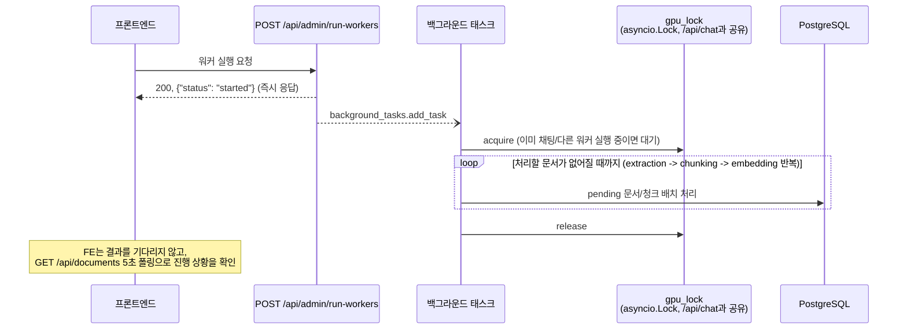

# 백그라운드 워커 실행 API 스펙

## 1. 엔드포인트

```
POST /api/admin/run-workers
```

인증 없음. `/api/v1/upload`(upload_api.md 참고)는 업로드 직후 이 로직을 **자동으로** 백그라운드
트리거하므로, 신규 업로드에 대해서는 프론트가 이 엔드포인트를 직접 부를 필요가 없다. 그래도
프론트가 명시적으로 호출하는 경우가 세 가지 있다.

1. zip 업로드 직후 — zip 안의 여러 문서를 한 번에 등록하는 `/api/documents/upload-zip`은
   자동 트리거가 없어서, 새로 등록된 문서가 있으면 프론트가 직접 이어서 호출한다.
2. `retry`(문서 관리) 직후 — `document_management_api.md` 참고, retry는 상태만 되돌리고
   워커를 자동으로 안 돌린다.
3. 드로어의 "처리 시작" 버튼 — 사용자가 수동으로 밀어 넣는 경우 (예: 서버 재시작 직후 `uploaded`
   상태로 멈춰있는 문서를 발견했을 때).

## 2. 흐름 (시퀀스 다이어그램)

이 요청 자체는 즉시 `202`류 응답을 주고, 실제 처리(추출→청킹→임베딩)는 응답 이후
백그라운드에서 진행된다 — OCR이 몇 분~몇십 분 걸릴 수 있어서 요청을 붙들고 있지 않는다.
겹쳐 호출해도 `gpu_lock`으로 직렬화되어 안전하다(채팅 응답 생성과도 이 잠금을 공유한다).



## 3. 요청 예시

```bash
curl -X POST "http://localhost:8000/api/admin/run-workers"
```

## 4. 응답 — 성공 (`200`)

```json
{ "status": "started" }
```

몇 개를 처리했는지는 이 응답에 담기지 않는다 (처리가 응답 이후 백그라운드에서 진행되기
때문). 진행 상황은 `GET /api/documents`(document_list_api.md)로 문서별 `status`를 봐야 한다.
