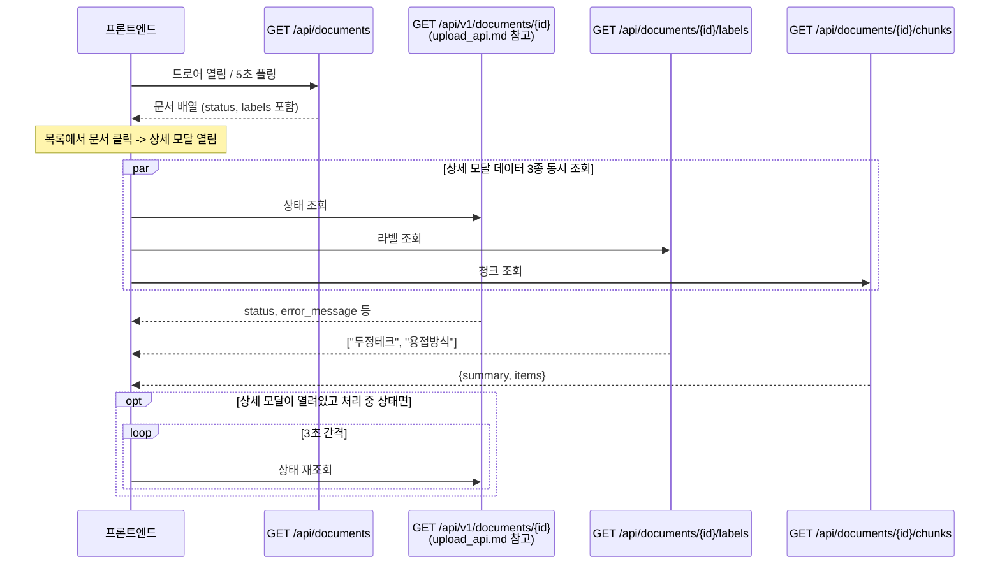

# 문서 목록 / 상세 조회 API 스펙

레거시 경로(`/api/v1` prefix 없음, 응답이 봉투 없이 그대로 나감)다. 업로드/상태폴링(`upload_api.md`)과
채팅(`chat_stream_api.md`)만 `/api/v1/*`로 옮겨졌고, 목록·라벨·청크·원본파일은 아직 `main.py`에
직접 정의된 예전 경로를 그대로 쓴다. 새로 호출부를 만들 때 이 차이를 헷갈리지 않도록 주의.

## 1. 엔드포인트

```
GET /api/documents
GET /api/documents/{document_id}/labels
GET /api/documents/{document_id}/chunks
GET /api/documents/{document_id}/file
```

인증 없음. 실패는 HTTP 상태 코드 + `detail` 문자열로 온다 (upload_api.md의 `success`/`error` 봉투
형식이 아님).

## 2. 흐름 (시퀀스 다이어그램)

문서 드로어(목록)를 열면 `GET /api/documents`로 목록을 받고, 처리 중인 문서가 하나라도 있으면
5초 간격으로 조용히(`quiet`, 로딩 스피너 없이) 다시 조회한다. 목록에서 문서 하나를 클릭해 상세
모달을 열면, 상태(`GET /api/v1/documents/{id}` — upload_api.md 참고)·라벨·청크 3개를 동시에 조회한다.



## 3. `GET /api/documents`

문서 전체 목록. 콘솔 문서 드로어의 기본 화면이며, 새로고침해도 이력이 남도록 항상 DB 전체를
`created_at desc`로 반환한다 (페이지네이션 없음).

### 요청 예시

```bash
curl "http://localhost:8000/api/documents"
```

### 응답 — 성공 (`200`)

```json
[
  {
    "document_id": "string",
    "filename": "string",
    "status": "ready",
    "current_page": null,
    "total_pages": 32,
    "retry_count": 0,
    "error_message": null,
    "warning_message": null,
    "extraction_quality_score": 0.92,
    "extraction_method": "paddleocr",
    "created_at": "2026-08-18T09:00:00",
    "updated_at": "2026-08-18T09:05:00",
    "indexed_at": "2026-08-18T09:05:00",
    "labels": ["두정테크", "용접방식"]
  }
]
```

| 필드 | 타입 | 설명 |
|---|---|---|
| `status` | string | `uploaded` `extracting` `needs_review` `extracted` `chunked` `ready` `failed` 중 하나 (DB enum `DocumentStatus` 그대로). **`embedding`은 실제로 존재하지 않는 상태값이다** — 청킹 후 임베딩은 별도 상태 없이 바로 `ready`로 간다. 프론트 `constants/documents.js`의 `PROCESSING_STATUSES`가 `embedding`을 폴링 대상으로 넣어두고 있는데, 이 값은 절대 응답에 나오지 않으므로 사실상 동작에 영향은 없지만 혼동의 소지가 있다. |
| `labels` | string[] | 이 문서에 붙은 라벨 전체 |
| `current_page` / `total_pages` | int \| null | OCR 진행률 |

## 4. `GET /api/documents/{document_id}/labels`

문서 하나에 지금 붙어있는 라벨만 조회 (라벨 수정 UI에서 현재값을 채울 때 사용).

```bash
curl "http://localhost:8000/api/documents/1f2e3d4c-.../labels"
```

응답 (`200`): `["두정테크", "용접방식"]`

## 5. `GET /api/documents/{document_id}/chunks`

문서 하나의 청크를 순서대로 확인 (청킹/OCR 품질 확인용, 상세 모달의 "청크 미리보기" 탭).

```bash
curl "http://localhost:8000/api/documents/1f2e3d4c-.../chunks"
```

### 응답 — 성공 (`200`)

```json
{
  "summary": { "total": 42, "text": 38, "table": 3, "image": 1 },
  "items": [
    {
      "chunk_id": "string",
      "text": "string",
      "length": 320,
      "chunk_type": "text",
      "table_confidence": null,
      "image_url": null,
      "page_number": 3,
      "is_short": false,
      "is_long": false
    }
  ]
}
```

| 필드 | 설명 |
|---|---|
| `chunk_type` | `text` \| `table` \| `image` |
| `is_short` | `text` 타입이고 길이 10자 미만 (과청킹 의심) |
| `is_long` | `text` 타입이고 길이 4000자 초과 |
| `image_url` | `image` 타입일 때만 `/images/...` (프론트는 API 베이스를 붙여서 사용) |

## 6. `GET /api/documents/{document_id}/file`

업로드된 원본 파일을 그대로 스트리밍 (`Content-Disposition: inline`). `fetch`가 아니라 `<a href>`나
`<iframe>` 같은 곳에 URL 자체를 꽂아 쓰는 용도라, 페이지 번호를 `#page=N` 프래그먼트로 붙여서
PDF 뷰어가 해당 페이지로 바로 스크롤하게 할 수 있다.

```
GET /api/documents/{document_id}/file#page=12
```

### 응답 — 실패 (`404`)

원본 파일이 DB에 경로가 없거나, 경로는 있는데 디스크에서 삭제/이동된 경우.

```json
{ "detail": "원본 파일이 디스크에 없습니다 (삭제되었거나 이동됨)." }
```
