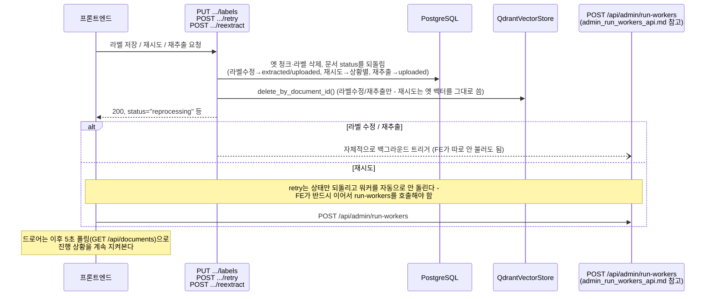

# 문서 관리(라벨 수정 / 재시도 / 재추출 / 삭제) API 스펙

`document_list_api.md`와 마찬가지로 `/api/v1` prefix 없는 레거시 경로다. 전부 문서 드로어의
"처리 중이거나 실패한 문서를 손보는" 동작들이라 하나의 문서로 묶었다.

## 1. 엔드포인트

```
PUT    /api/documents/{document_id}/labels
POST   /api/documents/{document_id}/retry
POST   /api/documents/{document_id}/reextract
DELETE /api/documents/{document_id}
POST   /api/documents/delete-batch
```

인증 없음. 실패는 HTTP 상태 코드 + `detail` 문자열.

## 2. 흐름 (시퀀스 다이어그램)

네 동작 모두 "DB 상태를 되돌리고 → 옛 벡터/청크를 지우고 → 백그라운드 워커를 다시 돌린다"는
같은 패턴을 공유한다. 차이는 어디서부터 다시 시작하느냐뿐이다.



## 3. `PUT /api/documents/{document_id}/labels`

문서의 라벨을 통째로 교체하고, 청크 접두어(`[문서: 라벨1, 라벨2]`)가 바뀌어야 하므로 자동으로
재청킹까지 시작한다. 저장 버튼 한 번으로 끝나야 해서, 별도 "재처리 시작" 호출이 필요 없다.

### 요청

```bash
curl -X PUT "http://localhost:8000/api/documents/1f2e3d4c-.../labels" \
  -H "Content-Type: application/json" \
  -d '{"labels": ["두정테크", "협동로봇"]}'
```

| 필드 | 타입 | 필수 |
|---|---|---|
| `labels` | string[] | Y (빈 배열 허용 — 라벨을 전부 지우는 경우) |

### 응답 — 성공 (`200`)

```json
{ "document_id": "string", "labels": ["두정테크", "협동로봇"], "status": "reprocessing" }
```

원문(OCR 결과)은 그대로 두고 청킹부터만 다시 한다 — `raw_text`가 있으면 `extracted`로, 없으면
(원문 추출 전에 라벨부터 붙인 경우) `uploaded`로 되돌린다.

### 응답 — 실패 (`404`)

```json
{ "detail": "문서를 찾을 수 없습니다." }
```

## 4. `POST /api/documents/{document_id}/retry`

실패했거나(`failed`) 멈춰있는(`extracting`인데 워커가 죽은 경우) 문서를 다시 처리 대상에 올린다.
**주의: 이 엔드포인트는 상태만 되돌릴 뿐 워커를 자동으로 실행하지 않는다** — 프론트는 이 호출
직후 반드시 `POST /api/admin/run-workers`를 이어서 호출해야 실제로 재처리가 시작된다
(`frontend/src/hooks/useDocuments.js`의 `retryProcessing`이 이렇게 두 호출을 이어서 한다).

```bash
curl -X POST "http://localhost:8000/api/documents/1f2e3d4c-.../retry"
```

### 응답 — 성공 (`200`)

```json
{ "document_id": "string", "status": "uploaded", "reset_stuck_chunks": 0 }
```

| 문서 상태였을 때 | 되돌아가는 상태 |
|---|---|
| `needs_review` | `uploaded` (OCR부터 재시도) |
| `failed` | `raw_text` 있으면 `extracted`, 없으면 `uploaded` |
| `extracting` (멈춤) | `uploaded` (OCR 캐시가 있어 재시도가 빠름) |

임베딩 재시도 상한(`worker_max_retries`)을 넘어 계속 제외되던 청크가 있으면 `embed_retry_count`도
같이 리셋한다 (`reset_stuck_chunks`에 개수가 찍힘).

## 5. `POST /api/documents/{document_id}/reextract`

라벨과 원본 파일은 보존하고, OCR 결과·청크·벡터만 버린 뒤 추출부터 다시 시작한다 (OCR 자체가
잘못 나온 경우 사용). 라벨 수정과 마찬가지로 **재처리를 자동으로 트리거한다** (retry와 다름).

```bash
curl -X POST "http://localhost:8000/api/documents/1f2e3d4c-.../reextract"
```

### 응답 — 성공 (`200`)

```json
{ "document_id": "string", "status": "reextracting" }
```

### 응답 — 실패

| 상황 | 상태 코드 |
|---|---|
| 문서 없음 | `404` |
| 원본 파일이 디스크에 없음 | `409` |

## 6. `DELETE /api/documents/{document_id}` / `POST /api/documents/delete-batch`

문서와 관련 DB 행(`DocumentChunk`, `DocumentLabel`), Qdrant 벡터, 디스크의 원본/이미지 파일까지
전부 정리한다. 단건 삭제는 배치 삭제(`document_ids: [id]`)의 얇은 래퍼다.

처리 중인 문서(`extracting` `extracted` `chunked`)는 삭제하지 않고 `blocked`로 이유를 돌려준다 —
워커가 그 사이에 지워진 문서를 참조하는 경쟁 조건을 막기 위해서다.

### 요청 — 배치

```bash
curl -X POST "http://localhost:8000/api/documents/delete-batch" \
  -H "Content-Type: application/json" \
  -d '{"document_ids": ["id-1", "id-2"]}'
```

| 필드 | 타입 | 필수 | 제약 |
|---|---|---|---|
| `document_ids` | string[] | Y | 1~100개 |

### 응답 — 성공 (`200`, 부분 실패도 200으로 옴 — 배열 3종으로 구분)

```json
{
  "deleted": ["id-1"],
  "blocked": [{ "document_id": "id-2", "reason": "현재 문서 처리 중입니다. 처리가 끝난 뒤 삭제해 주세요." }],
  "missing": [],
  "cleanup_warnings": []
}
```

### 단건 삭제 (`DELETE /api/documents/{document_id}`)

같은 로직을 하나에 대해서만 실행하되, `missing`이면 `404`, `blocked`면 `409`(사유는 `detail`)로
에러를 낸다 — 배치와 달리 단건은 "됐다/안 됐다"만 필요하기 때문.

```bash
curl -X DELETE "http://localhost:8000/api/documents/1f2e3d4c-..."
```
