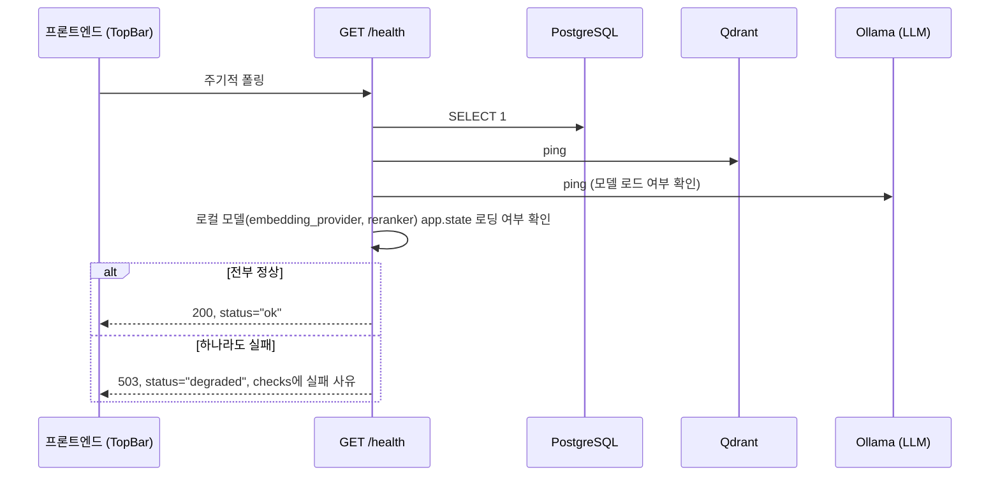

# 헬스체크 API 스펙

## 1. 엔드포인트

```
GET /health
```

인증 없음. 다른 API와 달리 `/api` prefix가 없다.

## 2. 흐름 (시퀀스 다이어그램)

콘솔 상단바가 서버 연결 상태 배지를 표시하기 위해 주기적으로 호출한다. 단순히 프로세스가
떠있는지가 아니라, PostgreSQL/Qdrant/Ollama에 **실제로 접속**해서 확인한다 — 앱은 떠있는데
의존 서비스 중 하나가 죽은 상태(예: Ollama만 재시작됨)를 잡아내려는 목적.



## 3. 요청 예시

```bash
curl "http://localhost:8000/health"
```

## 4. 응답

### 성공 (`200`)

```json
{
  "status": "ok",
  "checks": {
    "postgres": "ok",
    "qdrant": "ok",
    "ollama_model": "ok",
    "local_models": "ok"
  }
}
```

### 저하 (`503`)

`checks`의 각 항목이 실패 원인 문자열로 채워진다. 프론트는 `httpOk`가 아니어도(`response.ok`가
`false`) 응답 바디는 그대로 파싱해서 어떤 구성요소가 죽었는지 배지에 표시한다.

```json
{
  "status": "degraded",
  "checks": {
    "postgres": "ok",
    "qdrant": "error: Connection refused",
    "ollama_model": "ok",
    "local_models": "ok"
  }
}
```

네트워크 자체가 끊겨 요청이 실패하면(서버 프로세스가 안 떠있음) 프론트는 이 응답조차 못 받고,
`status: "offline"`으로 자체 처리한다 (`frontend/src/api.js`의 `getHealth`).
