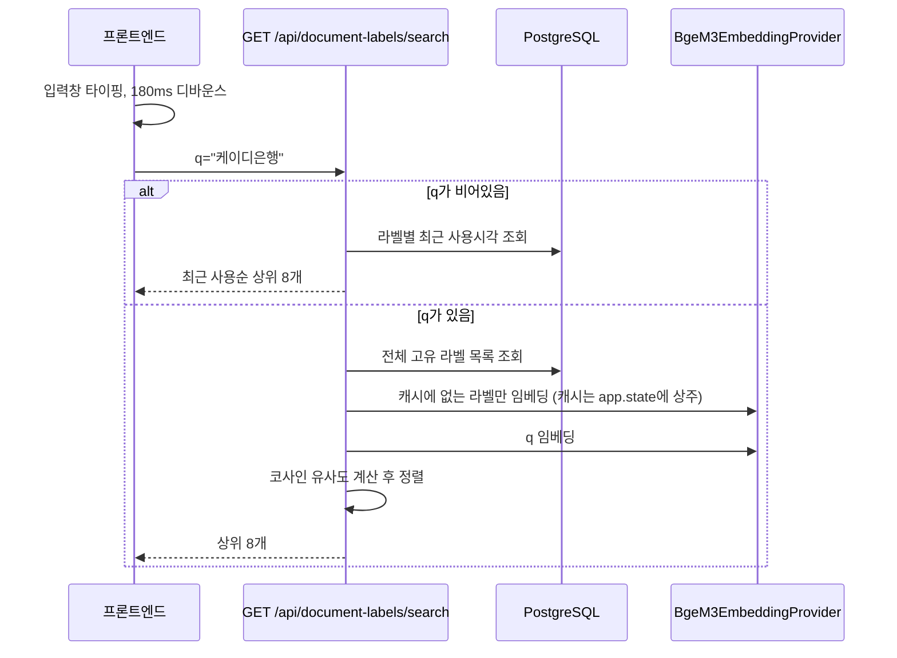

# 라벨 자동완성 API 스펙

## 1. 엔드포인트

```
GET /api/document-labels/search
```

| 파라미터 | 위치 | 타입 | 필수 | 설명 |
|---|---|---|---|---|
| `q` | query | string | N | 검색어. 비어있으면 최근 사용순 반환 |

인증 없음. 별도 라벨 카테고리 테이블 없이, 실제 문서에 쓰인 라벨들 자체가 자동완성 목록이 된다
(그래야 새 회사/제품군이 추가될 때마다 코드/스키마를 안 건드려도 자동으로 자동완성에 들어옴).

## 2. 흐름 (시퀀스 다이어그램)

업로드/라벨수정 화면에서 라벨 입력창에 타이핑할 때마다(디바운스 180ms) 호출된다. 글자 일치가
아니라 **임베딩 유사도**로 찾기 때문에, "케이디은행"이라고 쳐도 기존에 "KD은행"이 있으면 후보로
뜬다 (표기만 다르고 같은 대상인 경우를 잡아내려는 목적).



## 3. 요청 예시

```bash
curl "http://localhost:8000/api/document-labels/search?q=%EC%BC%80%EC%9D%B4%EB%94%94%EC%9D%80%ED%96%89"
```

## 4. 응답 — 성공 (`200`)

```json
["KD은행", "두정테크", "케이디산업"]
```

문자열 배열, 항상 최대 8개. 정확 일치/접두어 우선순위 같은 별도 로직 없이 순수 임베딩 유사도
내림차순이다 — "정확일치를 맨 위로" 같은 요구가 생기면 이 정렬 로직에 추가해야 한다.
