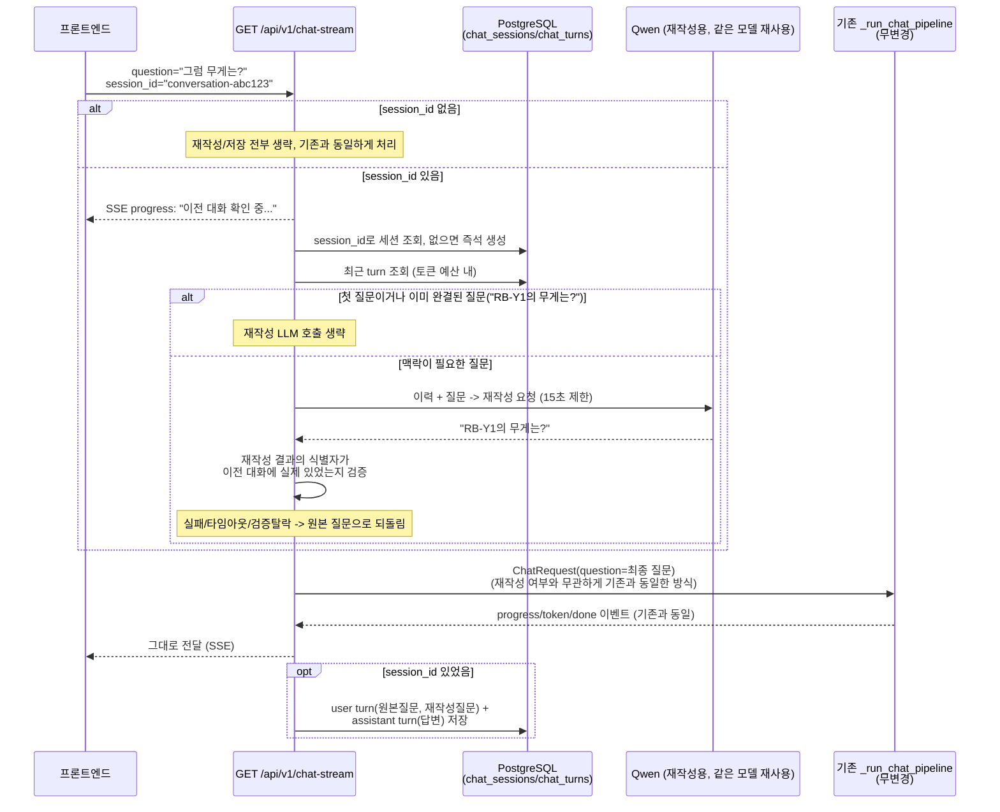
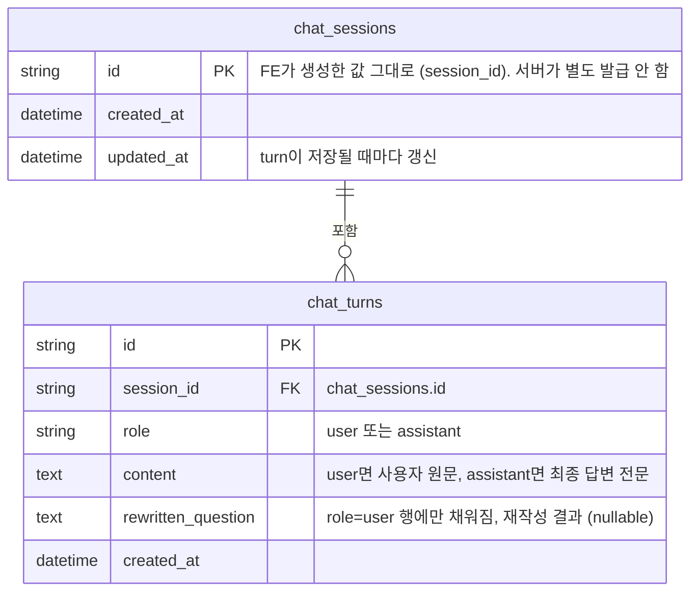

# 멀티턴 채팅 API 스펙 (`session_id` 파라미터)

`chat_stream_api.md`가 다루는 `GET /api/v1/chat-stream`의 단일 질문 계약(SSE 이벤트 포맷)은
그대로다 — 이 문서는 거기에 **선택 파라미터 `session_id` 하나가 추가되면서 생기는 차이**만
다룬다. 왜 이렇게 설계했는지는 `multi_turn_chat_design.md`(검토 기록), 서버 내부 코드 분기는
`app/backend/chat_stream.md`를 참고.

## 1. 엔드포인트

```
GET /api/v1/chat-stream?question=...&session_id=...
```

| 파라미터 | 위치 | 타입 | 필수 | 설명 |
|---|---|---|---|---|
| `question` | query | string | Y | 사용자 질문 (기존과 동일) |
| `session_id` | query | string | **N** | 대화(멀티턴) 식별자. 클라이언트가 생성해서 보낸다 |

**`session_id`를 안 보내면 오늘까지의 싱글턴 동작과 완전히 동일하다.** 재작성도, 대화 저장도
일어나지 않는다 — 기존 프론트/연동 코드는 아무것도 안 바꿔도 계속 그대로 동작한다.

## 2. 흐름 (시퀀스 다이어그램)



## 3. 응답 — SSE 이벤트

`chat_stream_api.md`의 이벤트 종류(`progress`/`token`/`done`)와 완전히 동일한 포맷이다.
`session_id`가 있을 때 **`progress` 이벤트가 기존보다 하나 먼저 온다**는 것만 다르다:

```json
{"type": "progress", "message": "이전 대화 확인 중..."}
```

이후 이벤트(`질문 언어 감지 중...` 등)부터는 기존과 동일하다. **최종 `done` 이벤트에는
재작성된 질문이 노출되지 않는다** — `data.answer`/`sources`/`images`만 오는 건 기존과 같다.
재작성된 질문이 뭐였는지 확인하려면 서버 로그나 DB(`chat_turns.rewritten_question`)를 봐야
한다 (지금은 API로 노출 안 함 — 필요해지면 `done` 이벤트에 디버그 필드로 추가하면 됨).

## 4. 이 호출이 만드는 부작용 (DB)

`session_id`가 있으면 매 요청마다 아래가 같이 일어난다.

| 상황 | 동작 |
|---|---|
| 그 `session_id`로 저장된 세션이 없음 | `chat_sessions`에 새로 생성 (별도 "세션 생성 API" 없음 — 이 호출 하나로 생성+사용이 같이 됨) |
| 요청 처리 완료 후 | `chat_turns`에 `role="user"` 행(원본 질문 + 재작성 질문)과 `role="assistant"` 행(최종 답변) 각각 1개씩 추가 |

즉 **`session_id`를 처음 보는 값으로 아무거나 보내도 에러가 안 나고, 그 자리에서 새 대화로
취급된다** — 존재 여부를 사전에 확인/생성하는 별도 API가 없다.

## 5. 재작성이 실제로 언제 일어나는지 (클라이언트가 알아야 할 동작)

| 상황 | 재작성 LLM 호출? | 최종적으로 검색에 쓰이는 질문 |
|---|---|---|
| `session_id` 없음 | 안 함 | `question` 그대로 |
| 이 세션의 첫 질문 | 안 함 | `question` 그대로 |
| 질문에 이미 모델명/라벨이 있음 (`"RB-Y1의 무게는?"`) | 안 함 | `question` 그대로 |
| 그 외 후속 질문 (`"그럼 무게는?"` 등) | 함 | 성공하면 재작성 결과, 실패/의심스러우면 `question` 그대로 |

**재작성이 실패해도 요청 자체는 실패하지 않는다.** Ollama 타임아웃, 예외, "이전 대화에 없는
제품명을 지어낸 것으로 의심됨" 중 어느 경우든 조용히 원본 질문으로 되돌아가서 계속 진행한다
— 클라이언트 입장에선 검색 품질이 조금 떨어질 수는 있어도 요청이 에러로 끝나는 일은 없다.

## 6. 요청 예시

```bash
# 1) 첫 질문 (세션이 이 자리에서 새로 생성됨)
curl -N -G "http://localhost:8000/api/v1/chat-stream" \
  --data-urlencode "question=RB-Y1 가반하중은?" \
  --data-urlencode "session_id=conversation-abc123"

# 2) 후속 질문 (같은 session_id -> "그럼 무게는?"이 "RB-Y1의 무게는?"으로 재작성됨)
curl -N -G "http://localhost:8000/api/v1/chat-stream" \
  --data-urlencode "question=그럼 무게는?" \
  --data-urlencode "session_id=conversation-abc123"
```

`-G --data-urlencode`를 쓰면 한글/공백을 직접 URL 인코딩할 필요가 없다 — 공백을 인코딩 안 하고
그냥 붙이면(`question=A B`) uvicorn이 `Invalid HTTP request received`로 거부한다.

## 7. 에러 응답

`chat_stream_api.md`의 에러 규칙과 동일하다 — `question`이 없으면 `422`, 그 외에는 HTTP
`200` + SSE `done` 이벤트의 `success: false`로 실패를 알린다. `session_id`는 어떤 값을 보내도
(형식이 이상해도) 별도 검증/에러가 없다 — 문자열이면 그대로 세션 id로 쓰인다.

## 8. DB 스키마

`app/db/models.py`에 정의된 실제 테이블이다. 마이그레이션은
`migrations/versions/0009_chat_sessions_and_turns.py`.



| 테이블 | 컬럼 | 타입 | 제약 | 설명 |
|---|---|---|---|---|
| `chat_sessions` | `id` | `String` | PK | `session_id` 쿼리 파라미터 값 그대로. 클라이언트가 생성 |
| | `created_at` | `DateTime(tz)` | `server_default=now()` | |
| | `updated_at` | `DateTime(tz)` | `onupdate=now()` | 지금은 조회에 안 쓰지만, 나중에 "최근 대화 목록" 정렬 기준으로 쓸 수 있어 미리 남겨둠 |
| `chat_turns` | `id` | `String` | PK, `uuid4` 기본값 | |
| | `session_id` | `String` | FK → `chat_sessions.id`, 인덱스(`ix_chat_turns_session_id`) | `_load_recent_turns()`가 이 컬럼으로 최신순 조회 |
| | `role` | `String` | not null | `"user"` \| `"assistant"` — 재작성 프롬프트 조립 시 발화자 구분용 |
| | `content` | `Text` | not null | |
| | `rewritten_question` | `Text` | nullable | `role="user"`일 때만 채워짐. 재작성이 안 일어났으면(첫 질문/완결된 질문/재작성 실패) `NULL` — 나중에 "왜 이 검색 결과가 나왔는지" 추적용 |
| | `created_at` | `DateTime(tz)` | `server_default=now()` | |

**기존 `chat_logs` 테이블과의 관계**: 손대지 않고 그대로 둔다. `chat_logs`는 일일보고서 참고자료
검색(`daily_report_api.md`)이 대화 구분 없이 과거 Q&A 전체를 훑는 용도로 이미 쓰고 있어서,
용도가 다른 이 기능과 억지로 합치지 않았다 — `_run_chat_pipeline`은 지금도 매 요청마다
`chat_logs`에 별도로 기록하고, `chat_turns`는 그와 별개로 이 라우터가 추가로 기록한다. 즉
같은 질문/답변이 두 테이블에 각각 다른 목적으로 중복 저장된다 (의도된 것).

## 9. 관련 문서

- 단일 질문 SSE 계약 전체: `chat_stream_api.md`
- 왜 이런 설계인지(검토 기록): `multi_turn_chat_design.md`
- 서버 내부 함수별 분기: `app/backend/chat_stream.md`
- RAG 파이프라인 자체(재작성 이후 흐름): `rag_pipeline.md`
