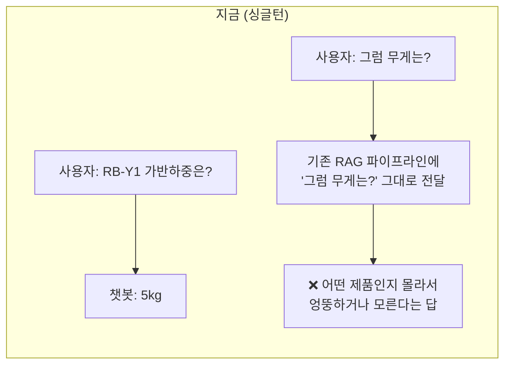
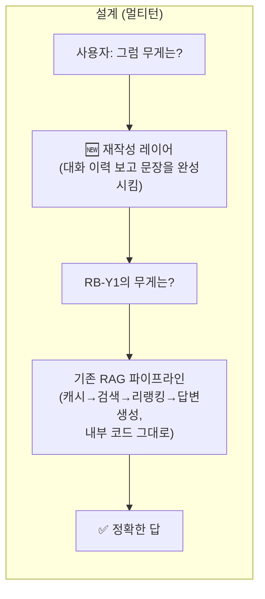
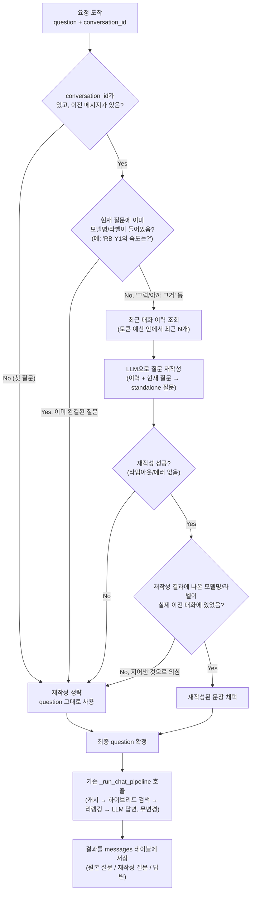
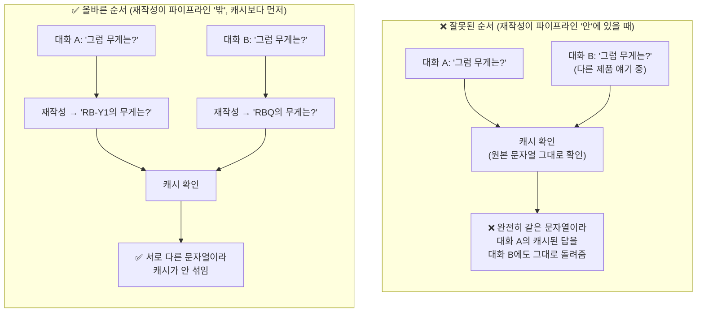
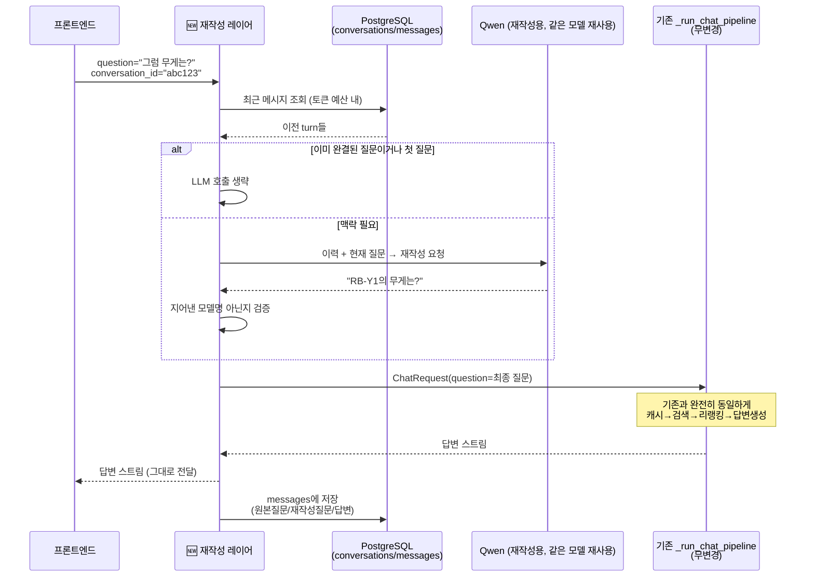
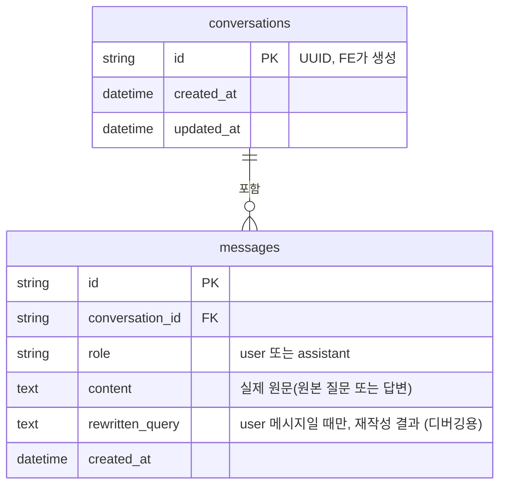
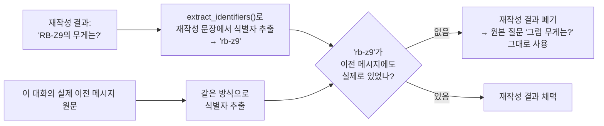

# 멀티턴 채팅 설계안 (구현 완료 — 이 문서는 설계 검토 기록)

> **주의**: 이 기능은 구현이 끝났다. 실제 요청/응답 계약과 DB 스키마는
> `multi_turn_chat_api.md`를, 서버 내부 코드 분기는 `app/backend/chat_stream.md`를 봐라.
> 이 문서는 "왜 이렇게 설계했는지"를 남겨두는 검토 기록으로 그대로 둔다 — 구현 중 실제로
> 바뀐 부분(예: `Conversation`/`Message` → `ChatSession`/`ChatTurn` 이름 변경)이 있어서
> 지금 코드와 100% 일치하진 않을 수 있다.

## 0. 지금 상황이 뭐가 문제인가



화면은 대화가 이어지는 것처럼 보이지만, 실제로 백엔드는 매 질문을 완전히 독립적으로 처리한다
(`rag_pipeline.md` 참고 — `_run_chat_pipeline`은 `question` 문자열 하나만 받는다). "그럼",
"아까 그거" 같은 표현은 이전 turn을 알아야 이해할 수 있는데, 지금은 그 정보가 아예 전달되지
않는다.

## 1. 설계 핵심 아이디어 — 기존 파이프라인은 안 건드린다



새로 만드는 건 **"재작성 레이어" 하나뿐**이다. 기존 검색/리랭킹/캐시 코드는 한 줄도 안 바뀐다 —
재작성 레이어가 문장을 완성시킨 다음, 그 완성된 문장을 지금과 똑같은 방식으로 기존 파이프라인에
넘기기만 한다.

## 2. 요청 하나가 처리되는 전체 흐름



가운데 있는 **D번 분기**(이미 완결된 질문이면 재작성 생략)와 **H번 분기**(재작성이 없는 걸
지어냈으면 버림)가 이 설계의 핵심 안전장치다. 둘 다 새 로직을 만드는 게 아니라, 검색/리랭킹이
이미 쓰고 있는 함수(`extract_identifiers`, `find_question_label_hints`)를 재사용한다.

## 3. 왜 재작성이 "캐시 확인보다 먼저" 있어야 하는가

이게 이 설계에서 제일 중요한 규칙이다. 순서를 틀리면 **다른 사람 대화의 캐시된 답이 섞여
나오는 버그**가 생긴다.



`_run_chat_pipeline`은 시작하자마자 `question_cache.get_exact(body.question)`을 호출한다
(`rag_pipeline.md` 2-2절). 재작성이 이 시점보다 늦게 일어나면 캐시는 원본 문자열("그럼
무게는?")을 그대로 보게 되고, 대화가 달라도 문자열이 같으면 캐시가 섞인다. 그래서 재작성은
**`_run_chat_pipeline`을 호출하기 전에, 완전히 별도 단계로** 끝나 있어야 한다.

## 4. API 변경안

```
지금:
POST/GET /api/v1/chat-stream?question=...

변경안:
POST/GET /api/v1/chat-stream?question=...&conversation_id=...   (conversation_id는 선택값)
```



## 5. DB 스키마안



기존 `ChatLog` 테이블(`app/db/models.py`)은 그대로 둔다 — 일일보고서 참고자료 검색
(`daily_report_api.md`)이 대화 구분 없이 과거 Q&A 전체를 검색하는 용도로 이미 쓰고 있어서,
용도가 다른 두 기능을 한 테이블에 합치지 않는다.

## 6. 재작성 LLM이 잘못된 제품명을 지어냈을 때 방어 로직



`extract_identifiers`/`find_question_label_hints`는 이미 검색·리랭킹에서 쓰고 있는 정규식 기반
함수를 그대로 재사용한다 (`rag_pipeline.md` 2-5절) — 새 판단 로직을 따로 만들지 않는다.

## 7. 구현 전 최소 검증 케이스

| # | 케이스 | 확인할 것 |
|---|---|---|
| 1 | 일반 후속 질문 ("그럼 무게는?") | "RB-Y1의 무게는?"으로 재작성됨 |
| 2 | 지시어("아까 그 모델") | 직전 언급된 모델명으로 정확히 치환 |
| 3 | 여러 제품 비교 후 후속 질문 | 어느 제품 얘기인지 애매하면 지어내지 않음 |
| 4 | 대화가 오래 이어진 뒤 후속 질문 | 토큰 예산 밖이면 무리한 추측 없이 원본 유지 |
| 5 | 재작성이 없는 제품명 생성 | 6번 방어 로직이 걸러내고 원본으로 fallback |
| 6 | 재작성 LLM 다운/타임아웃 | 예외 없이 원본 질문으로 계속 처리됨 |
| 7 | 이미 완결된 새 질문 | LLM 호출 자체가 안 일어남 (로그로 확인) |
| 8 | 서로 다른 대화의 동일 문자열 "그럼 무게는?" | 캐시가 안 섞이고 각자 다른 제품으로 답함 |

## 8. 아직 결정 안 된 것

- 재작성 레이어를 어느 엔드포인트에 붙일지 (`/api/v1/chat-stream`만? 콘솔용 `/api/chat`도?)
- 재작성 프롬프트에 넣을 이력의 정확한 토큰 예산 숫자
- 재작성 호출 자체의 timeout 값
- 답변 생성 단계에 대화 이력을 얼마나 더 줄지(현재안: v1에서는 아예 안 줌, 재작성된 질문만 전달)
