# RAG 파이프라인 흐름

특정 엔드포인트 하나가 아니라, 이 서버의 핵심 로직 두 단계 — **문서를 검색 가능하게 만드는
인덱싱 파이프라인**과 **질문에 답하는 질의 파이프라인** — 를 정리한 문서다. 각 단계마다
다이어그램을 먼저 보고, 그 아래 짧은 설명으로 "왜/어떻게"를 채우는 순서로 구성했다.

## 0. 전체 그림

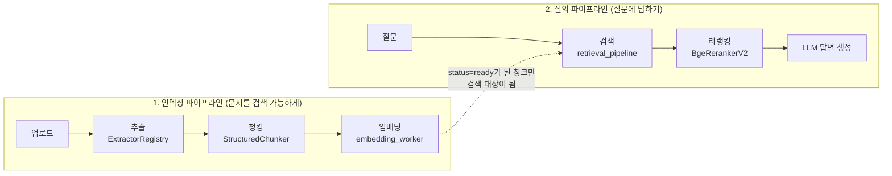

두 파이프라인은 **DB 상태(`Document.status`)로만 연결**되고 서로 직접 호출하지 않는다.

---

## 1. 인덱싱 파이프라인 — 문서를 검색 가능하게 만들기

### 1-1. 공통 설계: "찜 → 처리 → 저장"

세 워커(`extraction_worker.py`, `chunking_worker.py`, `embedding_worker.py`) 모두 같은 패턴을
쓴다. 오래 걸리는 작업(OCR, LLM 호출, GPU 인코딩) 동안 DB 행 잠금을 쥐고 있지 않으려는 목적이다.

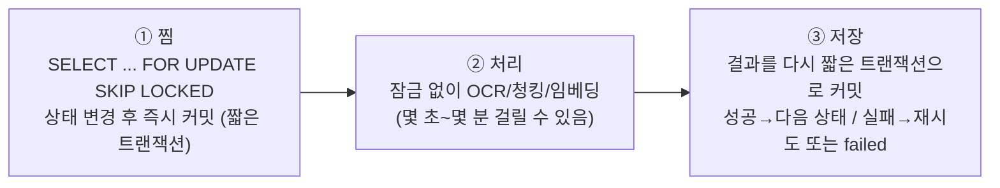

`SKIP LOCKED`는 이미 다른 워커가 잠근 행을 기다리지 않고 건너뛰게 해서, 워커를 여러 개
동시에 돌려도 같은 문서를 중복으로 집어가지 않는다. `②` 도중 프로세스가 죽으면 문서가 중간
상태에 멈춰 남는데, 추출 워커는 일정 시간 갱신이 없으면 자동으로 되돌리고, 급하면
`POST /api/documents/{id}/retry`(`document_management_api.md`)로 수동 복구한다.

### 1-2. 추출 워커 (`extraction_worker.py`) — `status: uploaded → extracted`

**담당 함수**: `process_pending_documents()`(찜) → `_process_one_document()`(문서 1개 처리)

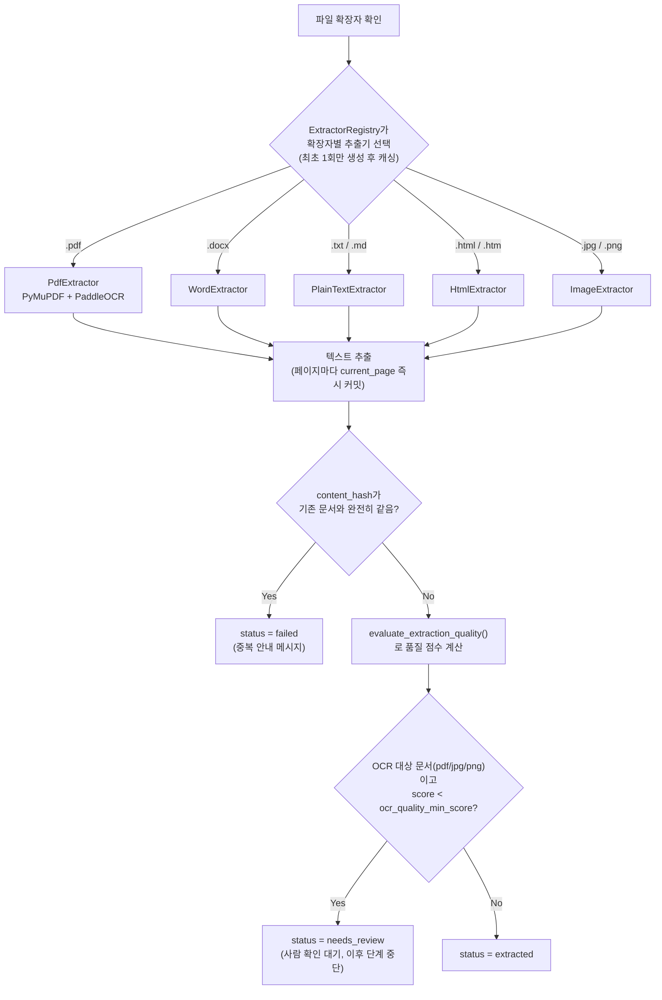

새 포맷을 지원하려면 `ExtractorRegistry`에 매핑 한 줄만 추가하면 되고, 워커/서버 코드는
안 건드려도 된다.

**품질 점수 공식** (`evaluate_extraction_quality`) — 한글 자리에 한자가 대량으로 나오는 건
PaddleOCR 언어 미지정이나 PDF ToUnicode 매핑 깨짐의 전형적 신호라, 강하게 감점한다:

```
score = 0.45·길이점수 + 0.30·문자밀도점수 + 0.25·어휘다양성점수 − 한자오염페널티
  길이점수        = min(글자수 / 180, 1.0)
  문자밀도점수    = min(영숫자·한글·한자 비율 / 0.55, 1.0)
  어휘다양성점수  = min(단어수 / 18, 1.0) × min(고유단어비율 / 0.45, 1.0)
  한자오염페널티  = min(한자 / (한글+한자) / 0.30, 1.0) × 0.70  (반복 특수문자 있으면 +0.10)
```

**실패 시**: `retry_count`를 올리고, 상한(`worker_max_retries`) 전이면 `uploaded`로 되돌려
다음 실행 때 자동 재시도, 상한을 넘으면 `failed`로 확정.

### 1-3. 청킹 워커 (`chunking_worker.py`) — `status: extracted → chunked`

**담당 함수**: `process_pending_documents()`. 추출 워커가 뭘로 텍스트를 뽑았는지 전혀 모르고
`Document.raw_text`(문자열)만 본다. 실제 분할은 `StructuredChunker`가 담당한다 — "제목/섹션
구조를 최우선으로 존중"하는 방식이라, 문장 유사도 같은 모호한 기준보다 "이 줄이 제목처럼
보이는가"를 정규식으로 판별하는 규칙 기반 로직이다 (CLAUDE.md의 "예측 가능한 방식 선호" 원칙).

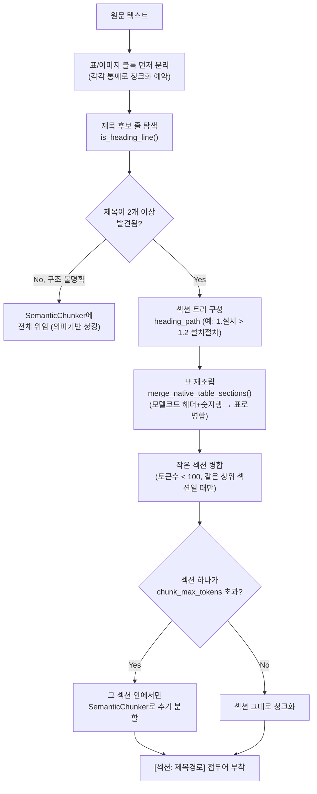

**제목 판별 규칙** (`is_heading_line`): 마크다운(`#`)·번호매기기(`1.`, `1.1`)·도메인 키워드("설치
방법" 등)·전대문자 줄 중 하나면 제목 후보. 단 **한국어 문장 종결 어미(다/요/음/함/니다)로
끝나면 절차 문장으로 보고 제외**한다 ("1. 프로그램을 종료한다."가 제목으로 오인되는 것 방지).
표 안 측정값 행("7.3 kg")도 단위 패턴으로 걸러 섹션 번호 오인을 막는다.

**라벨 자동 생성/교정** — 청크를 실제로 만들기 **전에** 먼저 처리한다 (`embedding_provider`/
`llm_provider`가 주입돼 있을 때만 동작):

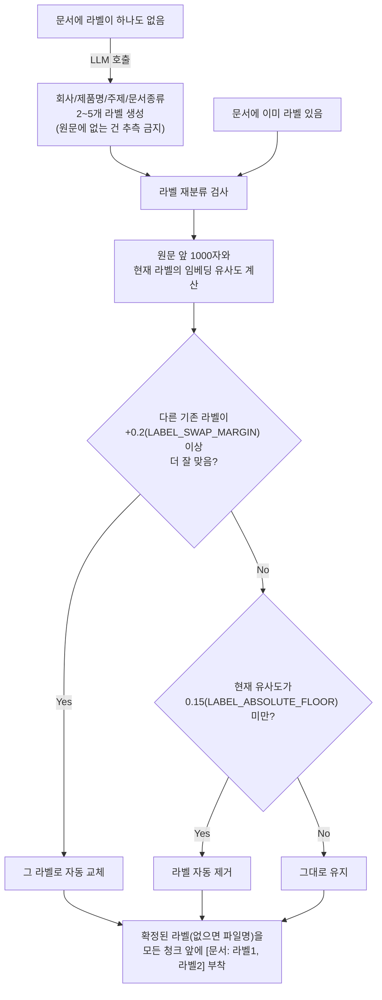

두 판단 모두 **사람에게 확인 안 받고 조용히 처리한다** (사용자가 "확인 절차 자체가
번거롭다"고 명시적으로 요청해서 이렇게 결정됨 — 여러 파일을 한 번에 묶어 라벨을 대충
적용했을 때 안 맞는 파일에 엉뚱한 라벨이 남는 걸 막는 안전장치).

### 1-4. 임베딩 워커 (`embedding_worker.py`) — `status: chunked → ready`

**담당 함수**: `process_pending_chunks()`. 청킹 워커가 어떤 전략을 썼는지 모르고
`DocumentChunk.embedded == false`인 행만 본다.

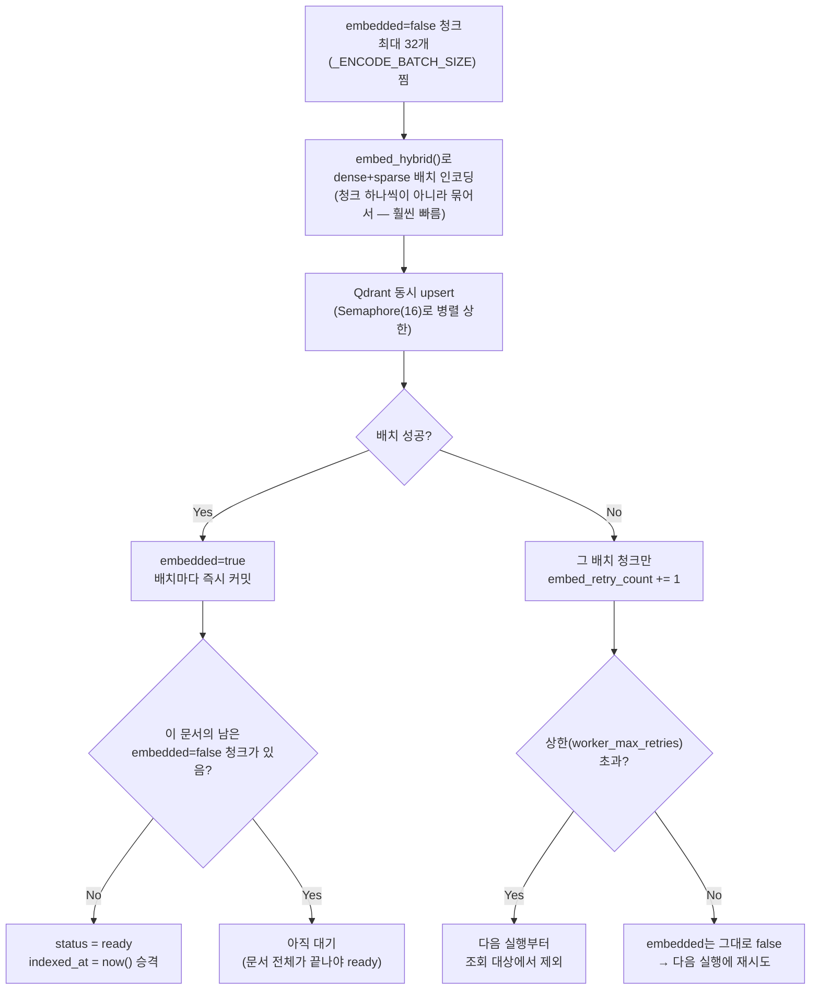

문서 하나가 청크 100개 중 1개만 계속 실패해도 그 문서 전체는 `ready`가 안 되고 검색에도
노출되지 않는다 — "일부만 검색되는" 어중간한 상태를 피하기 위해서다.

---

## 2. 질의 파이프라인 — 질문에 답하기

`app/main.py`의 `_run_chat_pipeline` 제너레이터 하나가 `/api/chat`, `/api/chat/stream`
`/api/v1/chat-stream`, `/api/evaluation/run` 네 군데에서 재사용된다.

### 2-0. 전체 흐름

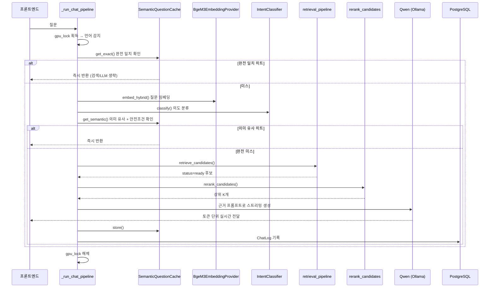

### 2-1. `gpu_lock` — 왜 필요한가

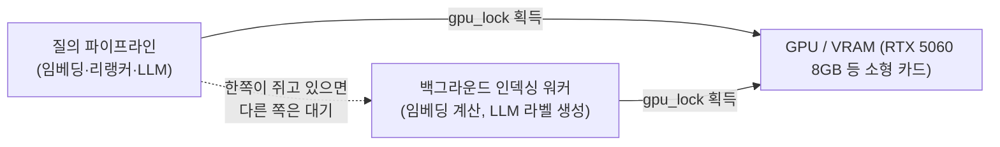

`app.state.gpu_lock`은 앱 시작 시 만들어지는 `asyncio.Lock()` 인스턴스 **하나**다. DB의
`FOR UPDATE SKIP LOCKED`는 "같은 문서를 두 워커가 중복으로 집어가는 것"만 막지, "채팅 응답
생성 중에 백그라운드 임베딩 배치가 동시에 GPU를 잡는 것"은 막지 못한다. 이게 겹치면 VRAM이
작은 카드에서 OOM이 났던 실제 사례가 있어서, GPU를 만지는 모든 경로를 이 잠금 하나로 완전히
직렬화한다.

### 2-2. 언어 감지 → 완전 일치 캐시 확인

`langdetect`로 질문 언어를 감지한 뒤, `SemanticQuestionCache.get_exact()`가 먼저 확인한다.

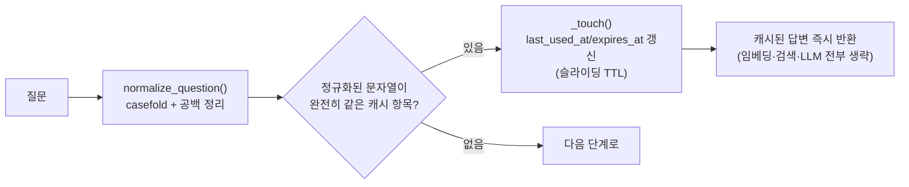

크기 제한(`question_cache_max_size`)을 넘으면 `last_used_at`이 가장 오래된 항목부터 제거된다
(LRU). 문서가 수정되면 그 문서를 근거로 쓴 캐시 항목만 골라 지운다.

### 2-3. 질문 임베딩 + 의도 분류

완전 일치가 없으면 `expand_search_query()`(고정된 동의어 사전 기반 — 예: "과정"이 들어간
질문엔 "공정 절차"를 덧붙임)로 검색어를 살짝 보강한 뒤, `embed_hybrid()`가 dense+sparse
벡터를 동시에 만든다. 이 벡터를 `IntentClassifier.classify()`가 재사용해서(중복 임베딩 방지)
11개 카테고리(overview/feature/specification/... )와의 코사인 유사도를 계산한다.

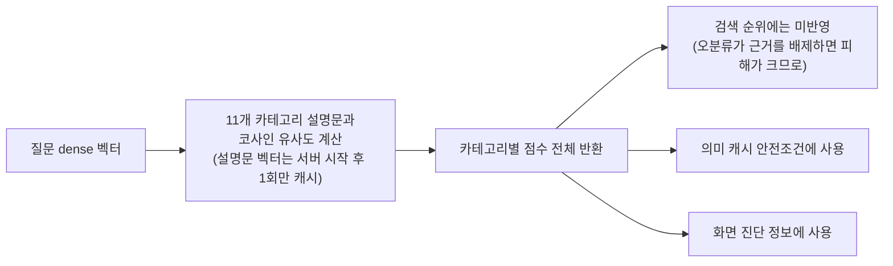

### 2-4. 의미 유사 캐시 안전조건 — `QuerySignature`

"임베딩이 비슷하다"만으로 캐시를 재사용하면 위험하다 — "A모델 가반하중은?"과 "B모델
가반하중은?"은 임베딩이 매우 비슷하지만 정답은 다르다. 그래서 5가지 항목을 뽑아 **전부
정확히 일치할 때만**(임계값 아님, `==` 비교) 캐시를 재사용한다.

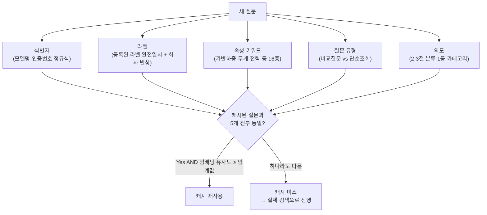

이렇게 하면 "비슷한 질문처럼 보이지만 실제로는 다른 걸 묻는" 경우의 오답 캐싱을 막는다.

### 2-5. 문서 검색 — `retrieve_candidates()`

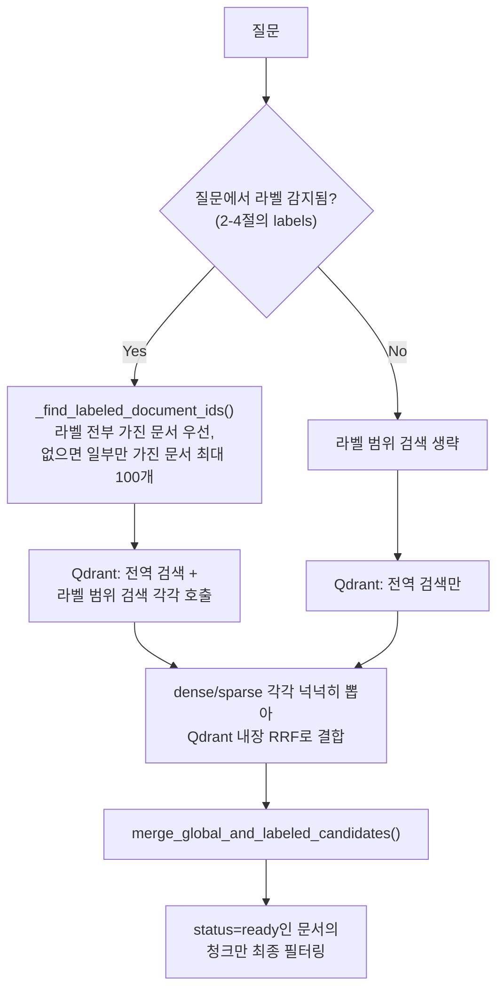

**후보 병합 우선순위** (`merge_global_and_labeled_candidates`):


①은 CPU 리랭커 모드에서 후보 개수를 줄일 때, 벡터 순위로는 밖이지만 정확한 숫자·사양이
담긴 청크가 통째로 사라지는 걸 막는 안전장치다.

> **RRF 점수 주의**: Qdrant의 RRF(Reciprocal Rank Fusion)는 점수 자체를 더하지 않고 **순위만**
> 결합한다. 반환 점수는 0~1 유사도가 아니라 `1/(k+순위)` 형태(k=60)라 1등이어도 보통 0.03대
> 값이 나온다. 여기에 "유사도 0.3 이상만" 같은 하한선을 걸면 사실상 전부 걸러진다 — CLAUDE.md에
> 기록된 실제 버그. 유사도 하한선은 반드시 다음 단계(리랭커)의 정규화된 점수에만 건다.

### 2-6. 리랭킹 — `rerank_candidates()`

1차 검색 후보를 질문과 다시 정밀 비교해서 순위를 다듬는 단계. 아래 흐름 전체를
`retrieval_pipeline.rerank_candidates()`가 순서대로 수행한다.

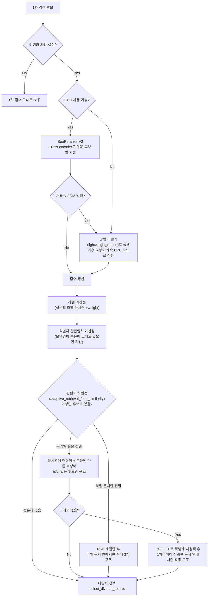

**CPU 경량 리랭커 공식** (`lightweight_rerank`, GPU 없거나 OOM 이후):

```
최종점수 = 0.10·1차검색 정규화점수
         + 0.45·질문 전체 핵심어 등장률
         + 0.30·질문 뒤쪽 3단어("묻는 속성") 등장률
         + 0.15·라벨 문서 여부(0 또는 1)
```

**다양화** (`select_diverse_results`): 한 문서의 비슷한 청크가 결과를 도배하지 않도록 문서당
상한을 둔다. 라벨 문서가 있으면 그 근거를 최소 3개까지 먼저 확보하고, 남는 자리는 점수 순으로
다시 채운다 (관련 문서가 하나뿐인 질문에서 다양화 때문에 컨텍스트가 줄어드는 손해를 막기 위해).

### 2-7. LLM 답변 생성

`answer_prompt.py`가 프롬프트를 만든다. 핵심 방침: **질문에 등장한 주장·용어도 사실로
가정하지 않고 참고 자료와 대조**하도록 강제한다.

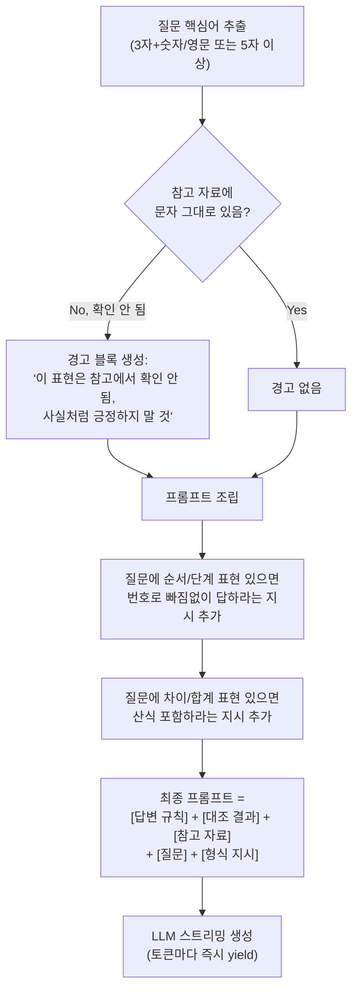

참고 자료 블록은 리랭킹 결과 각각을 `[참고 N | 파일: ... | 페이지: ...]`로 번호 매겨 이어붙인
것이며, LLM은 답변 문장 끝에 그 번호를 인용하도록 지시받는다. 실측 결과 전체 응답 시간의
90% 이상이 이 단계라, 스트리밍으로 체감 대기시간을 줄인다 (총 시간 자체는 줄지 않음).

### 2-8. 캐시 저장 + 로그

답변이 완성되면 `SemanticQuestionCache.store()`가 질문/답변/`QuerySignature`/근거 문서·청크
ID를 함께 저장하고, `ChatLog` 테이블에도 질문/답변을 기록한다 (일일 보고서의 참고자료 검색
등에서 재사용됨, `daily_report_api.md` 참고).

---

## 3. 핵심 구성요소

| 역할 | 구현체 | 비고 |
|---|---|---|
| 임베딩 | `BgeM3EmbeddingProvider` (BAAI/bge-m3) | dense+sparse 동시 지원, `embed_hybrid()` 하나로 처리 |
| 벡터DB | `QdrantVectorStore` | dense+sparse를 내장 RRF로 결합, `document_id` 메타데이터로 문서 단위 삭제 가능 |
| 리랭커 | `BgeRerankerV2` (BAAI/bge-reranker-v2-m3, Cross-encoder) | GPU 없거나 OOM 나면 `lightweight_rerank`로 자동 전환 |
| LLM | `QwenOllamaProvider` (Ollama, qwen3:8b/4b) | 스트리밍 생성 지원 |
| 질문 캐시 | `SemanticQuestionCache` | 완전 일치(슬라이딩 TTL) / 의미 유사(임베딩 유사도 + `QuerySignature` 완전 일치) 2단 |
| 의도 분류 | `IntentClassifier` | 11개 카테고리, 서버 시작 후 1회 임베딩 캐시, 검색 순위엔 미반영 |

## 4. 관련 문서

- 업로드/상태 폴링: `upload_api.md`
- 채팅 스트리밍: `chat_stream_api.md`
- 워커 수동 실행: `admin_run_workers_api.md`
- 라벨 수정 시 재인덱싱: `document_management_api.md`
- 라벨 개념 자체: `CLAUDE.md`의 "문서 라벨 시스템" 절
