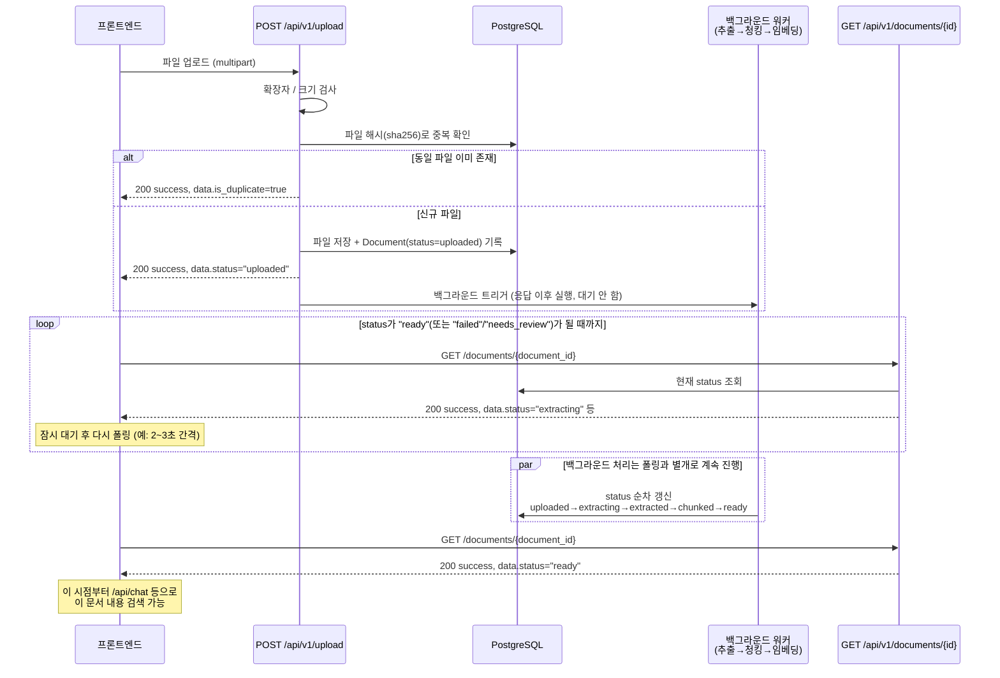

# 문서 업로드 / 상태 조회 API 스펙

## 1. 엔드포인트

```
POST /api/v1/upload
GET  /api/v1/documents/{document_id}
POST /api/documents/upload-zip
```

`upload-zip`만 `/api/v1` prefix가 아니라 `main.py`에 직접 정의된 레거시 경로다 (5절 참고).
단일 파일 업로드와 zip 업로드는 프론트에서 같은 화면(파일 드롭)을 쓰지만 내부적으로 서로 다른
엔드포인트·응답 형식을 호출하므로 헷갈리지 않게 주의.

업로드 후 곧바로 검색 가능한 게 아니다 — 파일 저장/등록만 끝난 상태(`status: "uploaded"`)로
응답이 오고, OCR → 청킹 → 임베딩 처리는 서버가 백그라운드에서 이어서 진행한다. 프론트는
업로드 응답을 받은 직후부터 `GET /api/v1/documents/{document_id}`를 몇 초 간격으로 폴링해서
`status`가 `"ready"`가 되는 시점을 확인해야 한다 (그 전까지는 이 문서 내용이 검색/답변에
쓰이지 않는다).

인증 없음. HTTP 상태 코드가 그대로 성공/실패를 의미한다 (chat-stream과 달리 SSE가 아님).

## 2. 흐름 (시퀀스 다이어그램)

업로드 한 번에 두 엔드포인트가 함께 쓰인다 — `POST /upload`는 등록 + 백그라운드 처리 시작만
하고 바로 응답하며, 실제 처리가 끝났는지는 `GET /documents/{id}`를 반복 호출해서 확인한다.



## 3. `POST /api/v1/upload`

### 요청

`multipart/form-data`

| 필드 | 타입 | 필수 | 설명 |
|---|---|---|---|
| `file` | file | Y | 업로드할 파일 |
| `labels` | string[] | N | 이 문서를 설명하는 태그 (예: `["두정테크", "용접방식"]`). 같은 키로 여러 번 보내면 됨 |

지원 파일 형식: `.pdf` `.docx` `.txt` `.md` `.html` `.htm` `.jpg` `.jpeg` `.png`
(zip 일괄 업로드는 이 엔드포인트에서 지원하지 않음)

파일 크기 상한: 서버 설정값(`max_upload_size_mb`, 기본 200MB) 초과 시 `413`.

### 요청 예시

```bash
curl -X POST "http://localhost:8000/api/v1/upload" \
  -F "file=@manual.pdf" \
  -F "labels=두정테크" \
  -F "labels=용접방식"
```

### 응답 — 성공 (`200`)

```json
{
  "success": true,
  "data": {
    "document_id": "string",
    "filename": "string",
    "status": "uploaded",
    "is_duplicate": false
  }
}
```

같은 파일(바이트 단위로 완전히 동일)이 이미 업로드돼 있으면, 새로 등록하지 않고
`is_duplicate: true`와 함께 기존 문서의 `document_id`/`status`를 그대로 돌려준다.

### 응답 — 실패

| 상황 | 상태 코드 | `error.code` |
|---|---|---|
| 지원하지 않는 확장자 | `400` | `VALIDATION_ERROR` |
| 파일 크기 초과 | `413` | `VALIDATION_ERROR` |

```json
{
  "success": false,
  "error": {
    "code": "VALIDATION_ERROR",
    "message": "사람이 읽는 실패 사유"
  }
}
```

## 4. `GET /api/v1/documents/{document_id}`

업로드 후 처리 진행 상황을 확인하는 폴링용 엔드포인트.

### 요청 예시

```bash
curl "http://localhost:8000/api/v1/documents/1f2e3d4c-..."
```

### 응답 — 성공 (`200`)

```json
{
  "success": true,
  "data": {
    "document_id": "string",
    "filename": "string",
    "status": "ready",
    "error_message": null,
    "warning_message": null,
    "current_page": 12,
    "total_pages": 12
  }
}
```

| 필드 | 타입 | 설명 |
|---|---|---|
| `status` | string | 파이프라인 진행 단계. 아래 "status 흐름" 참고 |
| `error_message` | string \| null | `status: "failed"`일 때 실패 원인 |
| `warning_message` | string \| null | 실패는 아니지만 품질 경고 (예: OCR 저품질) |
| `current_page` / `total_pages` | int \| null | OCR 진행률 (이미지/텍스트 등 페이지 개념이 없는 문서는 `null`) |

**`status` 흐름:**
```
uploaded → extracting → extracted → chunked → ready   ← 이 상태부터 검색/답변에 사용됨
                └→ needs_review (OCR 품질 미달, 사람 확인 필요 — 청킹/임베딩 진행 안 함)
각 단계 실패 시 어디서든 → failed (error_message 참고)
```

### 응답 — 실패 (`404`)

```json
{
  "success": false,
  "error": {
    "code": "NOT_FOUND",
    "message": "문서를 찾을 수 없습니다."
  }
}
```

## 5. `POST /api/documents/upload-zip` (일괄 업로드)

zip 파일 하나를 받아 안의 PDF/Word/텍스트/HTML을 전부 찾아 자동으로 업로드 등록한다 (중첩 압축도
재귀적으로 풀어서 찾음, 압축 안 폴더 구조는 무시하고 파일명만 사용).

**단일 업로드와의 차이 두 가지**:
1. 봉투(`success`/`data`) 없이 그대로 반환한다 — `/api/v1/upload`와 응답 형식이 다르다.
2. `labels` 파라미터 자체가 없다. 공통 라벨을 zip 안 문서들에 한 번에 적용하는 기능은 아직 없음
   (프론트도 zip 업로드일 때는 항목별 라벨 입력을 숨기고, 공통 라벨 일괄 적용도 `.zip` 항목은
   건너뛴다 — `UploadItem.jsx`, `useDocuments.js`의 `applyCommonLabels`).
3. 등록만 하고 처리(OCR→청킹→임베딩)를 자동으로 시작하지 않는다 — `/api/v1/upload`와 달리
   업로드 후 프론트가 `POST /api/admin/run-workers`를 직접 호출해야 한다
   (`admin_run_workers_api.md` 참고).

### 요청 예시

```bash
curl -X POST "http://localhost:8000/api/documents/upload-zip" \
  -F "file=@documents.zip"
```

### 응답 — 성공 (`200`)

```json
{
  "created": [
    { "document_id": "string", "filename": "manual.pdf", "is_duplicate": false }
  ],
  "skipped": ["unsupported_file.exe"]
}
```

| 필드 | 설명 |
|---|---|
| `created[].is_duplicate` | 이미 등록된 파일(해시 일치)이면 `true`, 새로 등록됐으면 `false` |
| `skipped` | zip 안에 있었지만 지원하지 않는 확장자라 건너뛴 파일명 목록 |

### 응답 — 실패

| 상황 | 상태 코드 |
|---|---|
| `.zip`이 아닌 파일 | `400` |
| 압축 해제 후 총 용량이 `max_zip_total_uncompressed_mb` 초과 | `413` |
