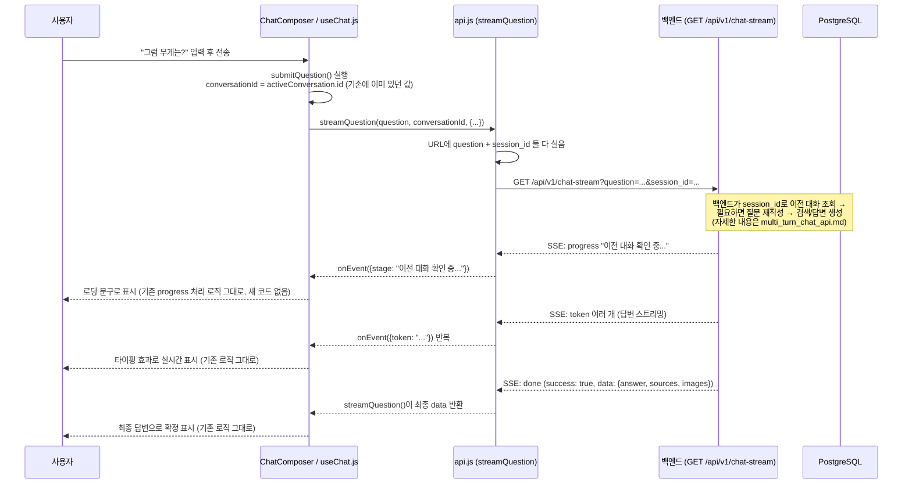

# 멀티턴 채팅 — 프론트엔드 변경사항

백엔드에 멀티턴(후속 질문이 이전 대화를 이해하는) 기능이 추가되면서, 프론트엔드는 **딱 두
파일, 코드 몇 줄만** 바뀌었다. 그런데 그 몇 줄이 뭘 하는지 코드만 봐서는 안 보여서, 여기서
"왜 바뀌었고 실제로 무슨 일이 일어나는지"를 그림과 함께 정리한다.

백엔드 쪽 전체 설계는 `docs/hanju/api/multi_turn_chat_api.md`(API 계약)와
`docs/hanju/api/multi_turn_chat_design.md`(설계 배경)를 참고. 이 문서는 **프론트 코드
관점**에서만 본다.

## 0. 한 줄 요약

프론트가 이미 갖고 있던 값(대화창 id)을 요청에 하나 더 실어 보내는 것뿐이다. **화면
컴포넌트, 상태관리, UI는 하나도 안 바뀐다.**

```
바뀌기 전: 질문만 보냄           → 백엔드가 그 질문만 보고 답함 (매번 새 사람인 것처럼)
바뀐 후:   질문 + 대화창 id를 보냄 → 백엔드가 그 대화창의 이전 메시지를 참고해서 답함
```

## 1. 바뀐 파일

| 파일 | 무엇이 바뀌었나 |
|---|---|
| `frontend/src/api.js` | `streamQuestion()` 함수가 파라미터를 하나(`sessionId`) 더 받아서, 요청 URL에 `&session_id=...`를 추가로 붙인다 |
| `frontend/src/hooks/useChat.js` | `streamQuestion()`을 호출할 때, 지금 열려있는 대화창의 id(`conversationId`)를 그 새 파라미터 자리에 넘긴다 |

이 두 줄 외에 **컴포넌트(`.jsx`), 상태관리, 화면에 보이는 것 중 바뀐 건 하나도 없다.**
`conversationId`는 원래부터 `useChat.js` 안에 있던 값이다(대화창을 새로 만들 때
`crypto.randomUUID()`로 생성돼서 화면 제목/localStorage 저장용으로 이미 쓰이고 있었음) —
그 값을 요청에도 같이 실어 보내기 시작한 것뿐이다.

## 2. `api.js` — before / after

**before** (질문만 보냄):
```javascript
export async function streamQuestion(question, { signal, onEvent } = {}) {
  const query = encodeURIComponent(question);
  const response = await fetch(apiUrl(`/api/v1/chat-stream?question=${query}`), {
    headers: { Accept: "text/event-stream" },
    signal,
  });
```

**after** (두 번째 자리에 `sessionId` 파라미터 추가, URL에 조건부로 붙임):
```javascript
export async function streamQuestion(question, sessionId, { signal, onEvent } = {}) {
  const query = encodeURIComponent(question);
  const sessionParam = sessionId ? `&session_id=${encodeURIComponent(sessionId)}` : "";
  const response = await fetch(apiUrl(`/api/v1/chat-stream?question=${query}${sessionParam}`), {
    headers: { Accept: "text/event-stream" },
    signal,
  });
```

**주의할 점 — 함수 시그니처(파라미터 순서)가 바뀌었다.** 두 번째 인자 자리가
`{ signal, onEvent }` 옵션 객체에서 `sessionId`로 바뀌고, 옵션 객체는 세 번째 자리로
밀렸다. 이 함수를 호출하는 곳이 `useChat.js` 말고 또 있다면(지금은 없음) 같이 고쳐야 한다.

`sessionId`가 `undefined`/`null`/`""`이면 `sessionParam`이 빈 문자열이 돼서 **URL이
바뀌기 전과 완전히 동일**해진다 — 그러니 이 함수를 호출하는 다른 화면이 생기더라도
`sessionId`를 안 넘기면 예전처럼 싱글턴으로 그냥 동작한다.

## 3. `useChat.js` — before / after

**before**:
```javascript
const data = await streamQuestion(value, {
  signal: controller.signal,
  onEvent: (streamEvent) => { ... },
});
```

**after**:
```javascript
// conversationId를 백엔드의 session_id로 그대로 전달한다. 백엔드는 이 값으로 이전 대화를
// 조회해서 "그럼 무게는?" 같은 후속 질문을 standalone 질문으로 재작성한 뒤 검색한다.
const data = await streamQuestion(value, conversationId, {
  signal: controller.signal,
  onEvent: (streamEvent) => { ... },
});
```

`conversationId`는 이 함수(`submitQuestion`) 위쪽에서 이미 `const conversationId =
activeConversation.id;`로 뽑아놓고 화면 상태 업데이트에 쓰던 값이다 — **새로 가져올 필요
없이 있던 변수를 한 자리 더 쓰는 것뿐**이다.

## 4. 전체 시퀀스 (사용자가 후속 질문을 입력했을 때)



**핵심은 이 다이어그램에서 `UI`(useChat.js) 쪽 로직이 하나도 안 바뀌었다는 것이다.**
`onEvent` 콜백, 토큰 이어붙이기, `progress` 문구 표시, 최종 답변 확정 — 전부 원래
코드 그대로다. 바뀐 건 오직 `API`(api.js)로 넘어가는 요청 URL에 파라미터 하나가 더
붙는다는 것뿐. 그래서 화면 컴포넌트를 하나도 안 고쳐도 됐다.

## 5. 사용자 눈에 보이는 차이

| 상황 | 이전 | 이후 |
|---|---|---|
| "RB-Y1 가반하중은?" → "그럼 무게는?" | "그럼 무게는?"만 보고 검색 → 엉뚱하거나 "모르겠다" | 백엔드가 "RB-Y1의 무게는?"으로 이해하고 정확히 답함 |
| 새 대화창 시작(`startNewChat`) | (원래도 새 대화) | `conversationId`가 새로 생기니 백엔드도 완전히 새 대화로 취급 — 이전 대화창 내용을 안 끌어옴 (의도된 동작) |
| 재작성이 실패/타임아웃 나면 | 해당없음 | **프론트는 아무것도 몰라도 된다.** 백엔드가 조용히 원본 질문으로 처리하고 정상 답변을 준다 — 에러 화면이 뜨지 않는다 |
| 진행 상태 문구 | "질문 언어 감지 중..." 등 | 대화 맥락이 있으면 그 앞에 `"이전 대화 확인 중..."`이 하나 더 뜬다 (새 이벤트 타입 아님, 기존 `progress` 이벤트 그대로라 별도 처리 코드 불필요) |

## 6. 프론트가 추가로 해야 할 일이 있나

**지금 당장은 없다.** 이미 연결이 끝났다 — `conversationId`를 만들고 저장하는 로직
(`utils/conversations.js`)도 그대로고, 요청에 실어 보내는 것도 끝났다.

**나중에 고려할 만한 것(지금 스코프 아님)**:
- 재작성된 질문("RB-Y1의 무게는?")이 실제로 뭐였는지 지금은 API 응답에 안 실려 온다.
  디버깅 화면 같은 걸 만들고 싶으면 백엔드에 `done` 이벤트로 노출해달라고 요청 필요.
- 대화 목록/메시지는 여전히 브라우저 `localStorage`에만 저장된다 — 다른 PC에서 이어보는
  기능은 이번 작업 범위가 아니다(`docs/FRONTEND_FEATURES.md` 참고).

## 7. 브라우저에서 직접 확인하는 법

1. 개발자도구 Network 탭 열고, 채팅에서 질문 하나 보낸 뒤 이어서 후속 질문 전송.
2. 두 번째 요청 URL에 `session_id=conversation-xxxx...`가 붙어있는지 확인 (`chat-stream?question=...&session_id=...`).
3. 응답(EventStream) 탭에서 맨 처음 이벤트가 `{"type":"progress","message":"이전 대화 확인 중..."}`인지 확인.
4. 최종 답변이 첫 질문의 대상(예: RB-Y1)을 반영해서 나오는지 확인.

백엔드 쪽 로그로 재작성이 실제로 잘 됐는지 더 자세히 보고 싶으면
`docs/hanju/MULTI_TURN_TEST_GUIDE.md`의 시나리오를 참고.

## 8. 관련 문서

- API 요청/응답 계약: `docs/hanju/api/multi_turn_chat_api.md`
- 왜 이렇게 설계했는지: `docs/hanju/api/multi_turn_chat_design.md`
- 백엔드 내부 코드 흐름: `app/backend/chat_stream.md`
- 프론트 전체 기능/데이터 흐름 원칙: `docs/FRONTEND_FEATURES.md`
